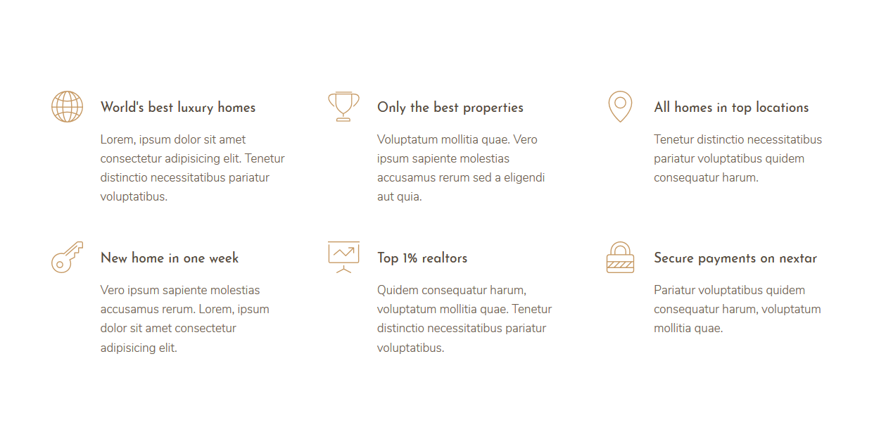
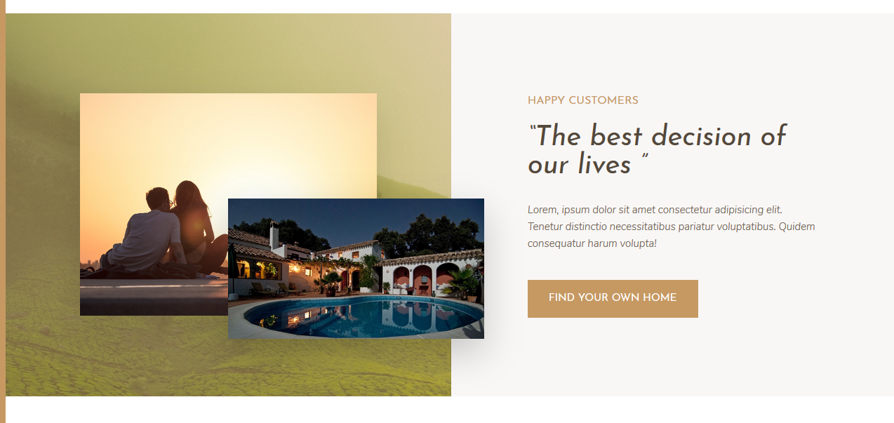
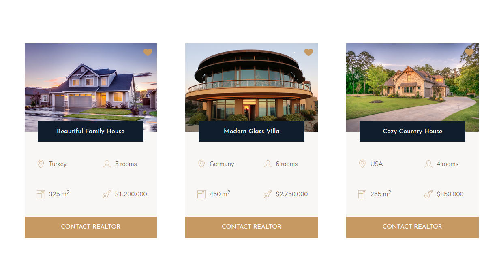
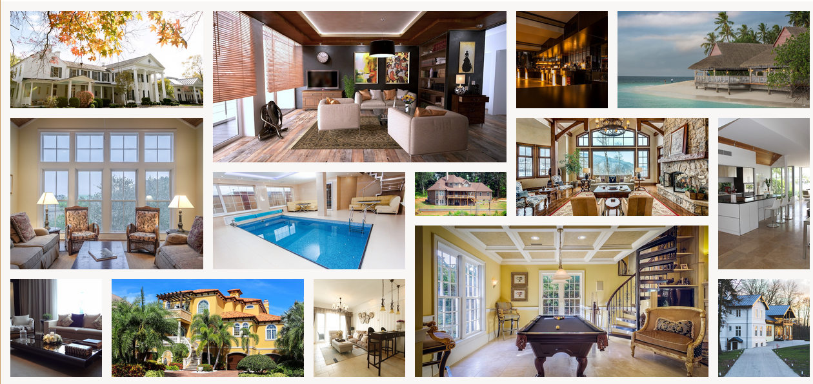

# Nexter

## Purpose

This project is build for improving my CSS and SASS skills..

## Some Screenshots










### Installing

Make sure download the required packages by:

```
npm install
```

And repeat

```
until finished
```
npm install node-sass --save-dev

## Authors

* **Furkan Özbek** - *Computer Engineering Student* - [afozbek](https://github.com/afozbek)

